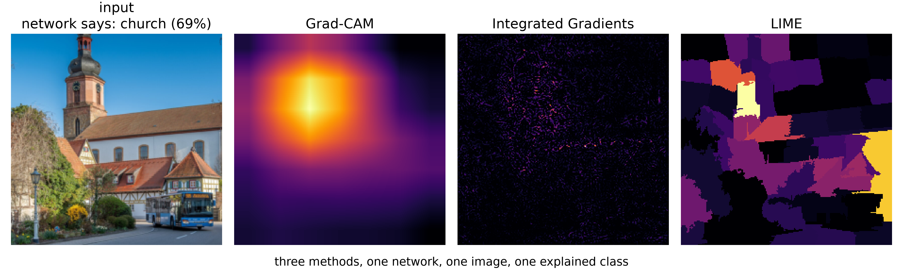
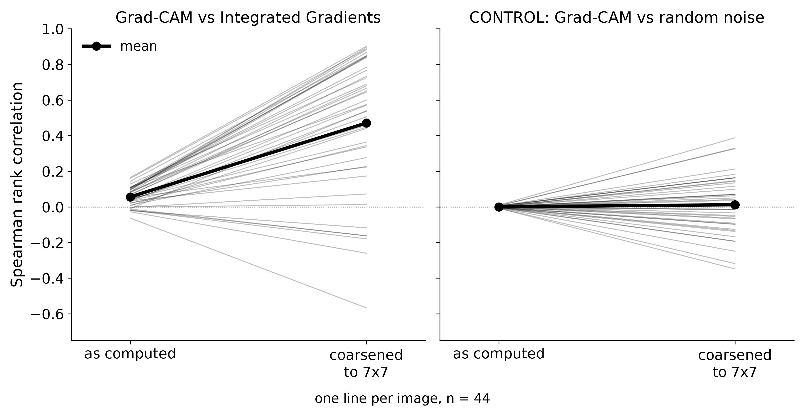

# Do explanation methods agree?

When a neural network makes a decision, interpretability methods produce a map
of which pixels mattered. This project asks whether three widely used methods —
**Grad-CAM**, **Integrated Gradients** and **LIME** — give the same answer when
applied to the same network, the same image and the same prediction. If they
disagree, at most one of them can be describing what the network actually did.


*Photograph: Achim Lammerts (Syntaxys), [Wikimedia Commons](https://commons.wikimedia.org/wiki/File:2026-03-27_D500-2061_Achim-Lammerts_Bus-595-Rheinzabern.jpg), CC BY-SA 4.0 — resized, centre-cropped, shown alongside attribution maps. This figure is CC BY-SA 4.0.*

## Finding

On 44 images explained by a pretrained ResNet-18, the methods at first appear
to disagree: only Grad-CAM and LIME agree, and Integrated Gradients is barely
related to either. But the two that agree are the two **coarse** methods —
Grad-CAM works on a 7×7 grid, LIME on about 56 segments — while Integrated
Gradients varies pixel by pixel. Averaging Integrated Gradients onto Grad-CAM's
grid makes it agree with Grad-CAM as well as LIME does. The same operation on
random noise does nothing.

| Grad-CAM compared with | Spearman [95% CI] |
|---|---|
| LIME | **0.49** [0.44, 0.55] |
| Integrated Gradients, as computed | 0.06 [0.04, 0.07] |
| Integrated Gradients, coarsened to 7×7 | **0.47** [0.36, 0.58] |
| random noise, coarsened (control) | 0.01 |



**Most of the disagreement is a difference of resolution, not of substance.**
A study that stopped at the first comparison would have reported a
real-looking negative result that is largely an artefact of how the maps are
rendered.

## How far to trust it

- **Scope:** one network, one seed, 44 images from Wikimedia Commons. Intervals
  are 95% bootstrap intervals over images.
- **Checked:** the accuracy of Integrated Gradients' integral; LIME at three
  segment sizes, with the prediction committed *before* the run (half
  confirmed); and a full reproduction from a fresh clone, where 43 of 44 image
  rows matched exactly.
- **Not shown:** that any method is *right* about the network — agreement is not
  faithfulness. The full list is in [LIMITATIONS.md](LIMITATIONS.md).

Every result, method, parameter choice and robustness check is in
**[docs/DETAILS.md](docs/DETAILS.md)**.

## Run it

Python 3.12, CPU only, about 15 minutes for the main experiment.

```bash
python -m venv .venv
.venv/Scripts/pip install -r requirements-lock.txt --extra-index-url https://download.pytorch.org/whl/cpu
.venv/Scripts/python src/download_images.py   # the 60 pinned images, pixel-verified
.venv/Scripts/python src/classify.py
```

`results/` already contains this study's outputs, so the long scripts skip work
that is done. The full pipeline and how to recompute from scratch are in
[docs/DETAILS.md](docs/DETAILS.md#reproducing).

## Repository

| | |
|---|---|
| `src/` | the pipeline — model, images, three methods, metrics, checks, figures |
| `data/` | which images were used, their licences, and pixel checksums |
| `results/` | every number, one CSV per stage |
| `figures/` | figures in English and Russian, 300 dpi |
| `docs/DETAILS.md` | the full account |
| `LIMITATIONS.md` | what this study does not show |
| `run_log.md` | every run with its date, environment and wall time |

## Licence

Code and the charts are [MIT](LICENSE). `figures/*/fig1_maps.png` contains a
CC BY-SA 4.0 photograph by Achim Lammerts (Syntaxys) and is therefore itself
CC BY-SA 4.0. Source images are not distributed; each keeps its own licence,
recorded in `data/sources.csv`.
