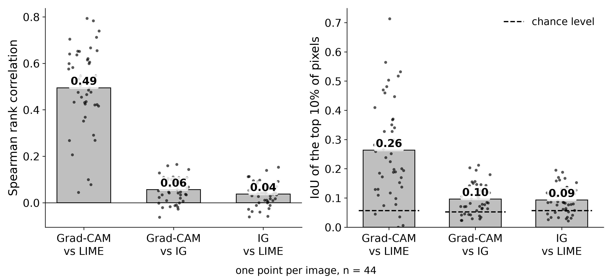

# Details

The full account behind the [README](../README.md): every result, how the
images were chosen, how agreement is measured, which parameters are choices,
the robustness checks, and how to reproduce everything. What the study does
**not** show is in [LIMITATIONS.md](../LIMITATIONS.md).

- [Results](#results)
- [What is compared](#what-is-compared)
- [Selecting images](#selecting-images)
- [Measuring agreement](#measuring-agreement)
- [Choices that change the numbers](#choices-that-change-the-numbers)
- [Robustness checks](#robustness-checks)
- [Reproducing](#reproducing)
- [Repository layout](#repository-layout)

## Results

Intervals are 95% percentile bootstrap intervals over images, 10,000
resamples, paired wherever two quantities come from the same images
(`src/bootstrap.py` → `results/bootstrap_ci.csv`). They describe variability
among images like these, not images in general.

### Agreement at native resolution

Measured at the resolution each method natively produces, the hypothesis fails.
Two of the three methods agree moderately; the third agrees with both only
weakly — about a tenth as much, though reliably above zero.

| Pair | Spearman [95% CI] | IoU | chance IoU |
|---|---|---|---|
| Grad-CAM vs LIME | **0.49** [0.44, 0.55] | 0.26 | 0.057 |
| Grad-CAM vs Integrated Gradients | 0.06 [0.04, 0.07] | 0.10 | 0.053 |
| Integrated Gradients vs LIME | 0.04 [0.02, 0.05] | 0.09 | 0.057 |



### Is the disagreement about resolution?

The two methods that agree are also the two that are **coarse**: Grad-CAM is a
7×7 grid stretched to full size, LIME is constant over ~56 segments, while
Integrated Gradients varies pixel by pixel. So a competing explanation is that
the agreement is about spatial scale, not about the network. It was tested by
averaging the Integrated Gradients map onto Grad-CAM's 7×7 grid and measuring
again, with the same operation applied to random noise as a control.

| Comparison | Spearman [95% CI] |
|---|---|
| Grad-CAM vs Integrated Gradients, as computed | 0.06 [0.04, 0.07] |
| Grad-CAM vs Integrated Gradients, coarsened to 7×7 | **0.47** [0.36, 0.58] |
| Grad-CAM vs LIME (for reference) | 0.49 [0.44, 0.55] |
| *control:* Grad-CAM vs random noise | 0.00 |
| *control:* Grad-CAM vs coarsened random noise | 0.01 |


The correlation rose on 38 of 44 images, by 0.42 on average (paired 95% CI
0.31 to 0.50). Coarsening random noise does **not** produce the same effect, so
the jump is not an artefact of the procedure — though coarsening does inflate
the spread of per-image values (control SD 0.161 against 0.004), which is why
only the 44-image mean is quoted.

Compared at a common scale, Integrated Gradients agrees with Grad-CAM about as
well as LIME does: the paired difference is −0.02, 95% CI −0.16 to +0.10. That
interval includes zero, so no difference is detectable at this sample size —
but a difference of up to about 0.15 either way cannot be ruled out either.

Six images moved the other way, three of them strongly — `zebra_03` reaches
−0.57 after coarsening. Agreement is not uniform, and the averages hide that.

### Confidence strata

| Grad-CAM vs LIME | Confident (32) | Uncertain (12) | Difference [95% CI] |
|---|---|---|---|
| Spearman | 0.523 | 0.419 | +0.105 [+0.013, +0.194] |
| IoU above chance | 0.179 | 0.281 | −0.102 [−0.223, +0.016] |

One marginal effect and one null. Eleven intervals were computed without a
multiple-comparison correction, so there is no reliable effect of the network's
confidence on agreement.

## What is compared

| Method | Looks inside the network? | Native resolution | Signed? |
|---|---|---|---|
| Grad-CAM | yes — gradients at the last residual block | 7×7, upsampled to 224×224 | no, ReLU by construction |
| Integrated Gradients | yes — gradients along a path from a baseline | 224×224 | yes |
| LIME | no — perturbs segments and fits a linear model | ~56 segments | yes |

The three maps are compared after discarding negative attribution, so that all
of them answer the same question: *what counts as evidence for this class?*

SHAP is deliberately excluded — its cost on convolutional networks does not fit
the scope of this study.

## Selecting images

60 candidates are collected from Wikimedia Commons under CC0 / CC BY / CC BY-SA
/ public-domain licences only. `data/sources.csv` records the licence, author
and URL of every file; the images themselves are not committed.

Candidates are split by the network's own confidence into two strata:

| Stratum | Confidence | Images | Why |
|---|---|---|---|
| `confident` | ≥ 90 % | 32 | the original selection rule |
| `uncertain` | 40–70 % | 12 | a ≥90 % filter alone keeps only what the network already finds easy, which biases the study towards agreement |

Explanations target **the predicted class, not the intended one**. Five
photographs found by searching "Siberian husky" are sled races, and the network
calls them `dogsled` — correctly. The search term is not ground truth.

Images are removed only by a written rule, kept in `data/exclusions.csv` with a
reason. Rejected images stay in `results/candidates.csv` marked `excluded`.

## Measuring agreement

- **Spearman rank correlation** between two full maps.
- **IoU of the top 10 % most important pixels**, thresholded inside each map.

Neither metric needs the maps rescaled to a common range, so no normalisation is
applied — one fewer distortion between the methods and the numbers.

Two sanity checks fix how the numbers should be read:

```
a map against itself       Spearman  1.000    IoU 1.000
a map against random noise Spearman -0.001    IoU 0.053
```

**Chance IoU is not 0.** Two independent masks overlap by
`p1·p2 / (p1 + p2 − p1·p2)` on average — 0.053 when both cover 10 % of the
image. An IoU near that floor means *no* agreement, not *little* agreement.

The floor is computed **per pair**, not once. A quantile threshold cannot split
a LIME segment, so LIME's mask runs to 17 % on some images, which lifts its own
floor to about 0.067. Using one shared floor would flatter whichever pair has
the larger mask. Both mask sizes and the pair's chance IoU are recorded for
every image.

Spearman is the more trustworthy of the two metrics. A single LIME segment
landing on the top-10 % threshold can double the LIME mask and halve an IoU
while Spearman barely moves — see the reproduction check below.

## Choices that change the numbers

Several parameters are decisions rather than properties of the model, and some
of them are hidden in library defaults. They are stated explicitly in the code
and listed in [LIMITATIONS.md](../LIMITATIONS.md):

- Grad-CAM explains the last residual block; a different layer gives a different map.
- Integrated Gradients uses a **black** baseline. Black in pixel space is not a
  zero tensor — the network is fed normalised values, where zeros are mid-grey.
  Switching black to grey changed attribution magnitudes roughly threefold.
- LIME fills a switched-off segment with black too. The library default fills it
  with the segment's mean colour, which is LIME's baseline under another name.
- LIME segments with SLIC at a stated segment count rather than the default
  quickshift, so map resolution is comparable across images.

## Robustness checks

- **Integration steps for Integrated Gradients.** IG's completeness property
  requires its attributions to sum to F(input) − F(baseline); how far the sum
  misses measures the approximation error. At the 64 steps used, the error is
  under 5 % on all 44 images (median 1.2 %, max 4.4 %); at 32 steps it exceeds
  5 % on 12 images. The headline number does not move: Grad-CAM vs coarsened IG
  is 0.4709 / 0.4708 / 0.4705 at 32 / 64 / 128 steps.
  `src/check_ig_steps.py` → `results/ig_steps_check.csv`.
- **LIME segment size — a prediction, half confirmed.** Before the run
  (commit `8b8f34f`) the resolution account predicted that Grad-CAM vs LIME
  agreement would order 40 > 80 > 160 segments. SLIC produced 24, 56 and 107
  segments on average.

  | Segments requested | Spearman | IoU above chance |
  |---|---|---|
  | 40 | 0.511 | 0.199 |
  | 80 (main run) | 0.495 | 0.207 |
  | 160 | 0.319 | 0.166 |

  Finer than 80 lowers agreement: 80 − 160 is +0.175 [0.128, 0.222] for
  Spearman and +0.041 [0.004, 0.077] for IoU above chance. Coarser than 80 does
  not raise it: 40 − 80 is +0.016 [−0.029, 0.062] and −0.008 [−0.055, 0.041].
  The confirmed half has a competing explanation that was **not** stated in
  advance: LIME's sample count is fixed at 1000, so doubling the segments halves
  the data behind each segment's weight and makes the map noisier. The 80-segment
  rerun reproduces the main run exactly.
  `src/check_lime_segments.py` → `results/lime_segments_check.csv`.
- **Reproduction from a fresh clone.** On 2026-09-29 the repository was cloned
  into an empty folder, installed from `requirements.txt` into a new
  environment with fresh model weights, and run end to end. 59 of 60 images
  came back pixel-identical; `school_bus_04` had been re-encoded by Wikimedia.
  43 of 44 rows of `results_raw.csv` matched in every number; every Spearman
  figure matched to three decimals; all eleven bootstrap intervals kept the
  same side of zero. The one re-encoded image put a LIME segment on the top-10 %
  threshold: its LIME mask went from 10 % to 21 % and Grad-CAM vs LIME IoU from
  0.48 to 0.21, while Spearman moved by 0.01.
- **What the network actually sees.** Every image is centre-cropped to 224×224
  before any method runs, so all maps describe the crop, not the photograph.
  A watermark on one image turned out to lie entirely outside the crop.

## Reproducing

Python 3.12, CPU only. Randomness is pinned to one seed; two LIME runs with the
same seed are bit-identical.

Two things to know first:

- **Start from `download_images.py`, not `fetch_images.py`.** The committed
  `data/sources.csv` pins the 60 images this study used. `fetch_images.py`
  rebuilds that list from today's Commons search, which returns different
  files; it refuses to overwrite the list unless given `--force`.
- **`results/` already holds this study's outputs.** The long scripts resume by
  skipping rows that exist, so on a fresh clone they would recompute nothing.
  Move `results/results_raw.csv` and `results/lime_segments_check.csv` aside to
  recompute them, then compare.

```bash
python -m venv .venv
.venv/Scripts/pip install -r requirements-lock.txt --extra-index-url https://download.pytorch.org/whl/cpu

.venv/Scripts/python src/download_images.py      # fetch the 60 pinned images (resumable)
.venv/Scripts/python src/classify.py             # predictions and strata
.venv/Scripts/python src/run_experiment.py       # three maps per image (~15 min, resumable)
.venv/Scripts/python src/summarise.py            # results/summary.csv
.venv/Scripts/python src/resolution_control.py   # the coarsening test and its control (~3 min)
.venv/Scripts/python src/bootstrap.py            # 95% confidence intervals
.venv/Scripts/python src/figures.py              # figures, both languages
.venv/Scripts/python src/check_ig_steps.py       # IG step-count robustness (~7 min)
.venv/Scripts/python src/check_lime_segments.py  # LIME at 40 / 80 / 160 segments (~40 min)
```

`requirements-lock.txt` is the full freeze of the environment the numbers were
produced in. `requirements.txt` pins direct dependencies only, so pip resolves
everything else to whatever is current — a clean install three weeks after the
study pulled newer `networkx`, `contourpy`, `setuptools` and a dozen others.
They changed no result, but only the lock file is an exact record.

`download_images.py` checks every image against `data/image_checksums.csv`, a
digest of the decoded pixels this study used, and names any image that has
changed on Wikimedia since. File bytes are not compared: a re-download found
8 of 60 files changed only in metadata, and one (`school_bus_04`) re-encoded.

`run_log.md` records every run with its date, environment and wall time.

## Repository layout

| Path | Contents |
|---|---|
| `src/model.py` | the network, its preprocessing, its class names |
| `src/fetch_images.py` | build the candidate list from Wikimedia Commons (not needed to reproduce) |
| `src/download_images.py` | fetch the pinned images and verify their pixels |
| `src/classify.py` | predictions, confidence strata, exclusions |
| `src/attribution.py` | the three attribution methods |
| `src/metrics.py` | Spearman, top-10 % IoU, and the chance floor |
| `src/run_experiment.py` | all three maps per image, appended as it goes |
| `src/summarise.py` | means per pair and stratum |
| `src/resolution_control.py` | the coarsening test and the noise control |
| `src/bootstrap.py` | 95% bootstrap intervals, paired where images are shared |
| `src/check_ig_steps.py` | IG accuracy and stability at 32 / 64 / 128 steps |
| `src/check_lime_segments.py` | LIME segment size, with its prediction stated in the docstring |
| `src/figures.py` | the figures, in an English and a Russian version |
| `data/search_terms.csv` | the twelve search terms and their groups |
| `data/sources.csv` | provenance and licence of every candidate |
| `data/exclusions.csv` | images excluded by rule, each with its reason |
| `data/image_checksums.csv` | pixel digests of the images this study used |
| `results/candidates.csv` | every candidate with its prediction and stratum |
| `results/results_raw.csv` | one row per analysed image |
| `results/summary.csv` | means per pair, per stratum |
| `results/resolution_control.csv` | per-image before and after coarsening, and the control |
| `results/bootstrap_ci.csv` | the confidence intervals quoted above |
| `results/ig_steps_check.csv` | IG completeness error and agreement at each step count |
| `results/lime_segments_check.csv` | agreement at each LIME segment count |
| `figures/en`, `figures/ru` | 300 dpi PNGs, readable in black and white |
| `LIMITATIONS.md` | what this study does **not** show |
| `run_log.md` | every run: date, environment, wall time |
